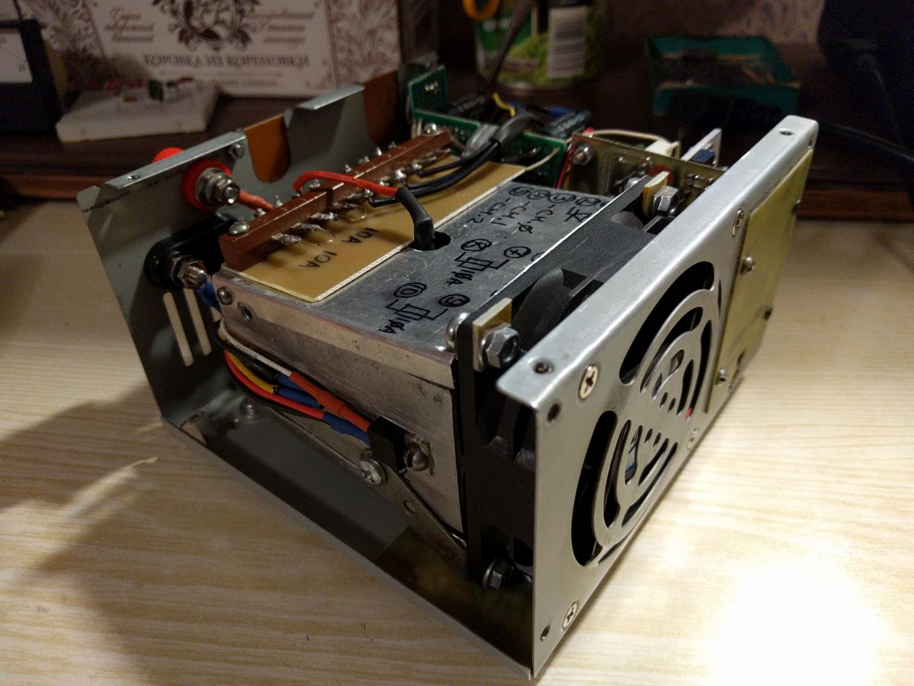

# Voltage-controlled direct current load.

## Operating conditions
Supply Voltage +19.5(+-2)V  
Load voltage (protected input) -200V to +55V  
Load voltage (unprotected input) 0 to +55V  
Load current (both inputs) 10A  
Load power (continuous) 100W  
Input voltage range 0-10V  
Input frequency (at full input voltage range) 0-2kHz  

## Schematics.

## The first prototype.

